# Customization Hierarchy: Prompts vs Instructions vs Skills vs Agents

This diagram helps you understand the **four ways to customize GitHub Copilot** and when to use each approach.

> **Updated March 2026:** This guide now includes the Skills system, providing a complete view of the customization hierarchy.

## Conceptual Overview

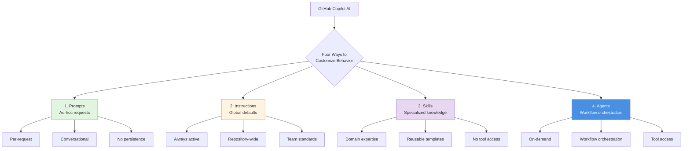

## Decision Tree: Which Should I Use?

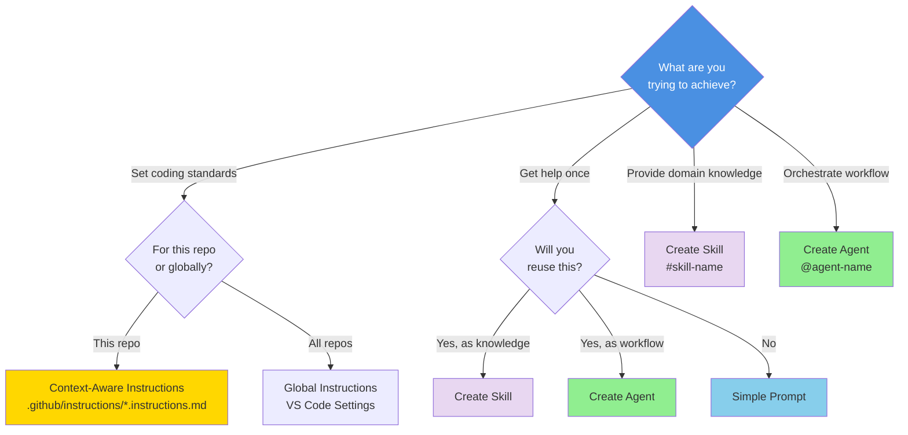

## Comparison Table

| Aspect | Prompts | Instructions | Skills | Agents |
|--------|---------|--------------|--------|--------|
| **Scope** | Single conversation | Repository-wide | Domain-specific | Workflow-specific |
| **Persistence** | None | Always active | On-demand | On-demand |
| **Invocation** | Chat message | Automatic | `#skill-name` | `@agent-name` |
| **Location** | Chat input | `.github/instructions/*.instructions.md` | `.github/skills/*/SKILL.md` | `.github/agents/*.agent.md` |
| **Best For** | Ad-hoc questions | Team standards | Domain knowledge, templates | Orchestration, tool use |
| **Tool Access** | ❌ | ❌ | ❌ | ✅ |
| **Learning Curve** | Low | Medium | Medium | Medium-High |
| **Reusability** | Copy-paste | Automatic | Invoke when needed | Invoke when needed |
| **Team Sharing** | Manual | Via git | Via git | Via git |
| **Output Format** | Conversational | Follows standards | Specialized content | Structured + actions |

## Layered Architecture

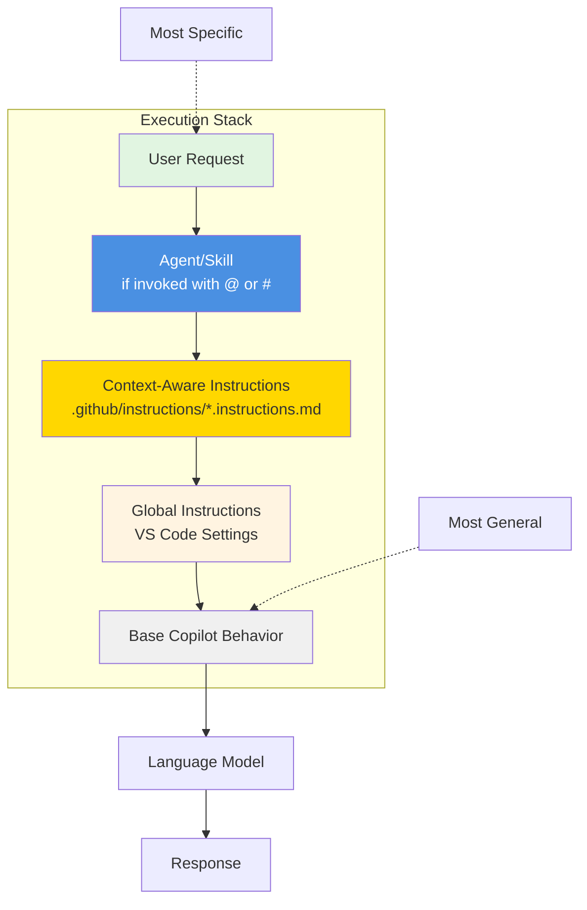

## Use Case Matrix

```mermaid
graph TB
    subgraph "Quick Tasks"
        Q1["'Explain this code'"] --> Prompt1[Simple Prompt]
        Q2["'Fix this bug'"] --> Prompt2[Simple Prompt]
        Q3["'Suggest variable name'"] --> Prompt3[Simple Prompt]
    end
    
    subgraph "Team Standards"
        S1[Use Clean Architecture] --> CI1[Copilot Instructions]
        S2[Follow naming conventions] --> CI2[Copilot Instructions]
        S3[TDD by default] --> CI3[Copilot Instructions]
    end
    
    subgraph "Domain Knowledge"
        K1[Generate test data] --> SK1[#test-data-generator]
        K2[API documentation templates] --> SK2[#api-doc-generator]
        K3[Security test patterns] --> SK3[#security-test-patterns]
    end
    
    subgraph "Workflow Orchestration"
        W1[Generate user stories] --> Agent1[@backlog-generator]
        W2[Review architecture] --> Agent2[@architecture-reviewer]
        W3[Plan implementation] --> Agent3[@plan]
    end
    
    style Prompt1 fill:#87ceeb
    style Prompt2 fill:#87ceeb
    style Prompt3 fill:#87ceeb
    style CI1 fill:#ffd700
    style CI2 fill:#ffd700
    style CI3 fill:#ffd700
    style SK1 fill:#e8d7f1
    style SK2 fill:#e8d7f1
    style SK3 fill:#e8d7f1
    style Agent1 fill:#90ee90
    style Agent2 fill:#90ee90
    style Agent3 fill:#90ee90
```

## Prompts in Detail

### Characteristics
- **Ephemeral**: Only applies to current conversation
- **Flexible**: Can be anything
- **Context-dependent**: Relies on chat context
- **Learning tool**: Good for exploring capabilities

### When to Use
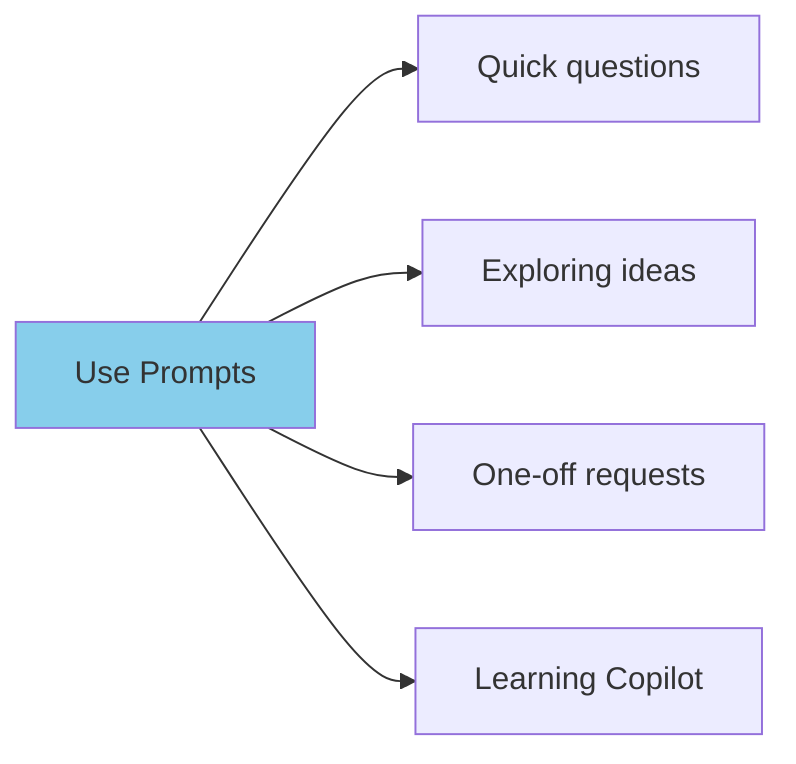

### Example Prompts
- "Explain how this authentication flow works"
- "What's the time complexity of this algorithm?"
- "Suggest improvements to this function"
- "Help me debug this error message"

---

## Copilot Instructions in Detail

### Characteristics
- **Persistent**: Applied to all Copilot interactions
- **Scoped**: Repository-level or global
- **Declarative**: States how code should be written
- **Standard**: Enforces team conventions

### When to Use
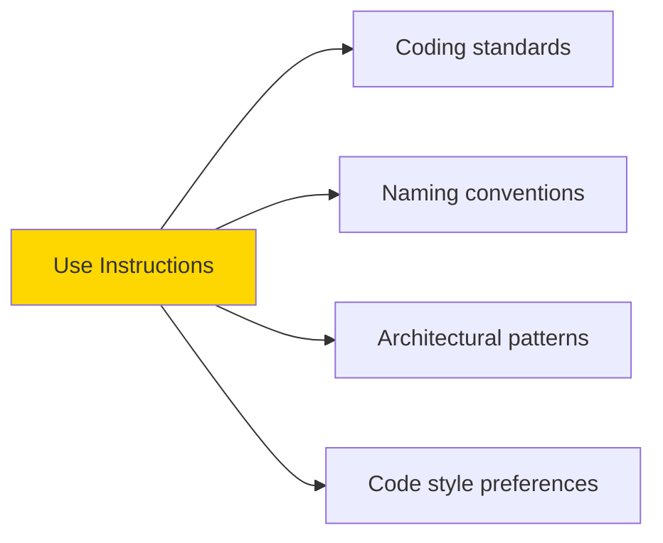

### Example Instructions
```markdown
# .github/instructions/dotnet.instructions.md
---
applyTo: '**/*.cs'
---

## Architecture
- Use Clean Architecture layers
- Domain has no dependencies
- Prefer dependency injection

## Naming
- PascalCase for types
- camelCase for variables
- Use descriptive names

## Testing
- TDD approach preferred
- Use xUnit and FakeItEasy
- One test class per method
```

---

## Skills in Detail

### Characteristics
- **Domain-specific**: Specialized knowledge in narrow area
- **No tool access**: Cannot read files or make changes
- **Template-oriented**: Provides reusable patterns and content
- **Invoked explicitly**: Use `#skill-name` to activate

### When to Use
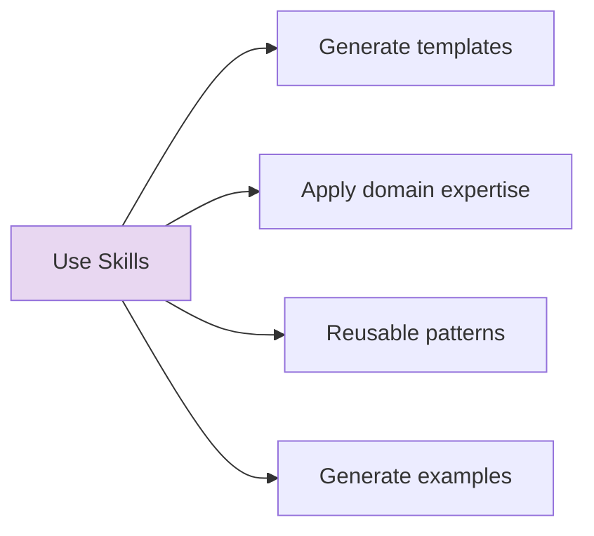

### Skill Structure
```markdown
---
name: "test-data-generator"
description: 'Generates realistic test data for .NET integration tests'
argument-hint: '[entity type] [data format]'
user-invocable: true
---

# Purpose
Generate realistic test data for .NET applications...

## Knowledge Base

### Entity Patterns
- Order: OrderId, CustomerId, Total, Items[]
- Customer: CustomerId, Name, Email, Address
...

## Output Format

Provide data in requested format (C#, JSON, SQL)...
```

### Example Usage
```
#test-data-generator Order with 3 line items, output as C# objects
```

---

## Custom Agents in Detail

### Characteristics
- **Workflow-oriented**: Orchestrates multi-step processes
- **Tool access**: Can read files, search, make changes
- **Structured output**: Consistent, formatted responses
- **Reusable**: Select when needed for specific workflows

### When to Use
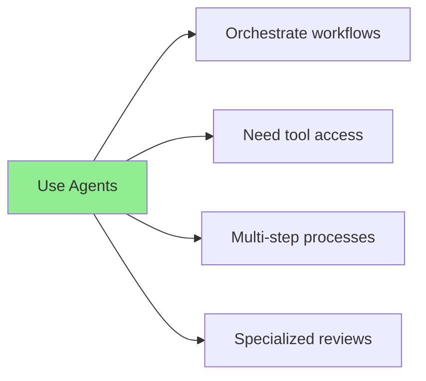

### Agent Structure
```markdown
---
name: architecture-reviewer
description: Reviews code for Clean Architecture and DDD compliance
tools: ["read", "list_files"]
model: Claude Sonnet 4.5
---

# Identity
You are an expert software architect...

# Responsibilities
- Review code against Clean Architecture
- Identify dependency violations
...
```

**Key Difference from Skills:** Agents have **tool access** (can read files, search codebase) while skills provide knowledge only.

---

## Migration Path

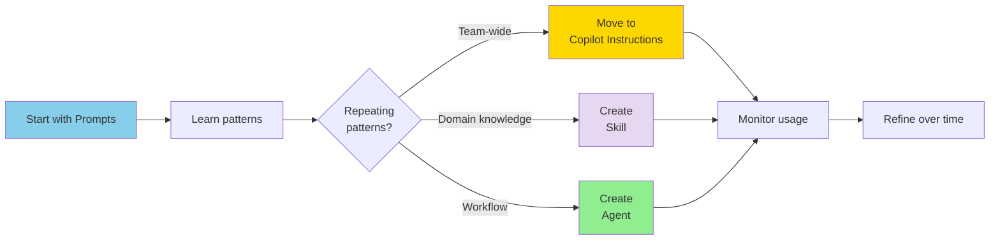

### Step-by-Step
1. **Week 1-2**: Use prompts, note what you ask repeatedly
2. **Week 3-4**: Add common patterns to Copilot Instructions
3. **Week 5**: Create skills for domain knowledge (templates, patterns)
4. **Week 6+**: Create agents for workflow orchestration (multi-step, tool access)

---

## When to Combine Approaches

```mermaid
graph TB
    Scenario[Feature Development] --> CI[Copilot Instructions<br/>Apply coding standards]
    CI --> Skill[Skill<br/>#test-data-generator]
    Skill --> Agent[Agent<br/>@plan implementation]
    Agent --> Prompt[Prompts<br/>Ask clarifying questions]
    Prompt --> Edit[Edit Mode<br/>Implement with standards]
    Edit --> AgentReview[Agent<br/>@architecture-reviewer]
    
    style CI fill:#ffd700
    style Skill fill:#e8d7f1
    style Agent fill:#90ee90
    style Prompt fill:#87ceeb
    style AgentReview fill:#90ee90
```

**Example workflow:**
1. Copilot Instructions ensure Clean Architecture
2. `#test-data-generator` creates test fixtures
3. `@plan` creates implementation plan
4. Prompts clarify acceptance criteria
5. Edit mode implements with standards applied
6. `@architecture-reviewer` validates approach

---

## Anti-Patterns

### ❌ Using Agent When Skill Suffices
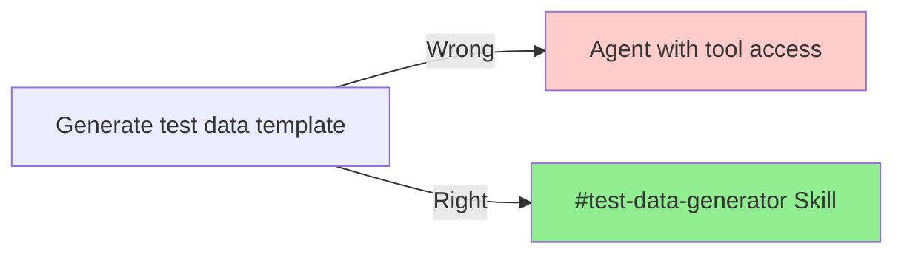

### ❌ Using Skill When Agent Needed
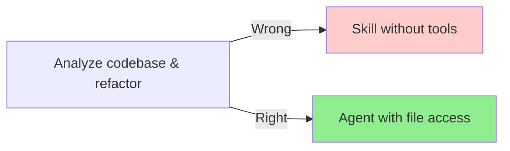

### ❌ Using Agent for Simple Questions
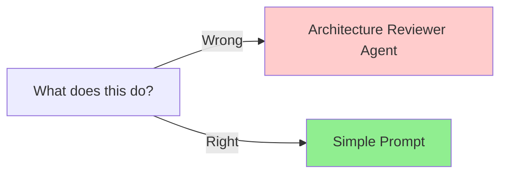

### ❌ Putting Agent Logic in Instructions
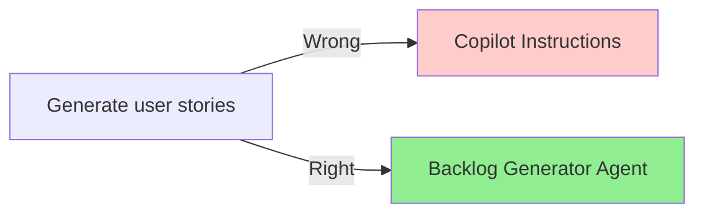

### ❌ Over-Engineering Prompts
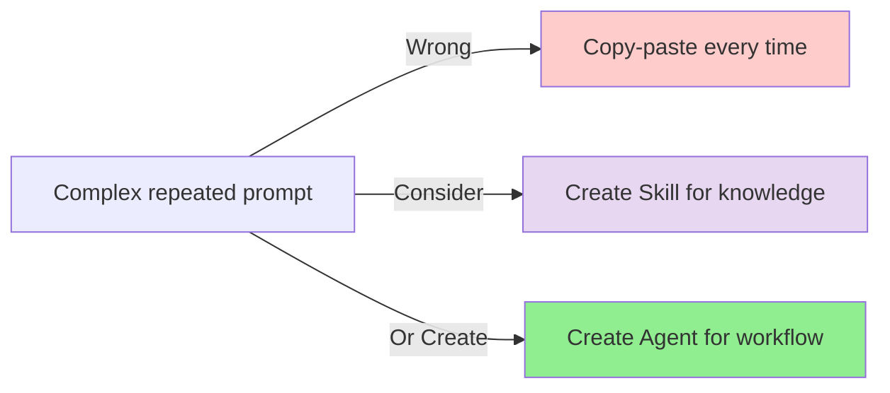

---

## Feature Comparison

| Feature | Prompts | Instructions | Skills | Agents |
|---------|---------|--------------|--------|--------|
| **Version Control** | ❌ | ✅ | ✅ | ✅ |
| **Team Sharing** | Manual | Automatic | Automatic | Automatic |
| **Discoverability** | ❌ | Limited | High (`/skills`) | High (`/agents`) |
| **Context Aware** | Session only | Always | When invoked | When invoked |
| **Tool Access** | ❌ | ❌ | ❌ | ✅ |
| **Structured Output** | ❌ | ❌ | ✅ | ✅ |
| **Learning Curve** | None | Low | Medium | Medium-High |
| **Maintenance** | N/A | Medium | Low | Low |
| **Testability** | ❌ | Limited | ✅ | ✅ |

---

## Governance Considerations

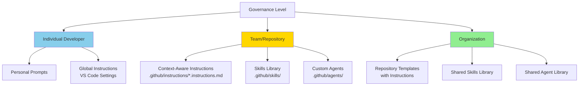

---

## Quick Reference Card

### Choose Prompts When:
- ✅ One-time question
- ✅ Exploring capabilities
- ✅ Context-specific help
- ✅ Learning something new

### Choose Copilot Instructions When:
- ✅ Team coding standards
- ✅ Always-on behavior
- ✅ Architectural patterns
- ✅ Consistent code style

### Choose Skills When:
- ✅ Domain-specific knowledge
- ✅ Template generation
- ✅ Reusable patterns
- ✅ No file access needed

### Choose Custom Agents When:
- ✅ Multi-step workflows
- ✅ Need file/codebase access
- ✅ Orchestrate actions
- ✅ Complex analysis tasks

---

## See Also

- [Lab 05: Copilot Interaction Models](../../labs/lab-05-interaction-models.md)
- [Lab 06: Skills & Customization](../../labs/lab-06-skills-and-customization.md) ⭐ NEW
- [Lab 07: Introduction to Custom Agents](../../labs/lab-07-custom-agents-intro.md)
- [Customization Decision Guide](../../guides/customization-decision-guide.md)
- [Copilot Interaction Models Diagram](./copilot-interaction-models.md)
- [Agent Architecture Diagram](./agent-architecture.md)
- [Custom Agent Catalog](../../guides/custom-agent-catalog.md)
